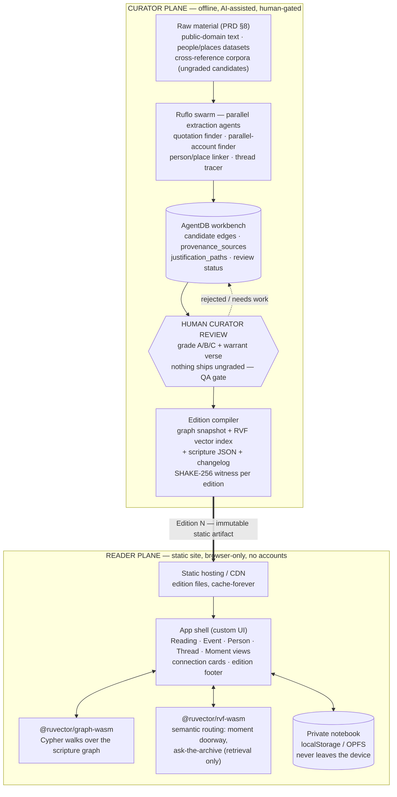
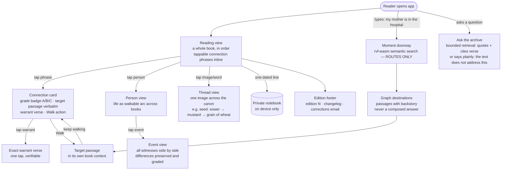
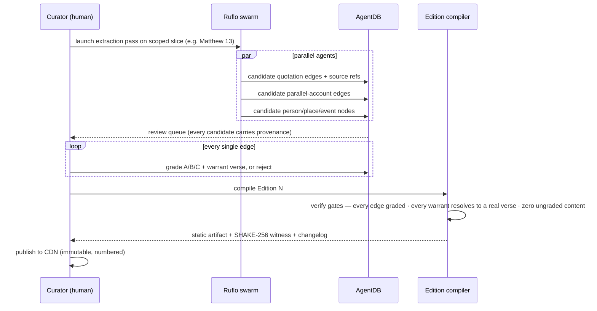

# Walk the Word — Architecture on the Ruv Stack

**Status:** Proposed · derived from `docs/01_inital/PRD-living-scripture-graph.md`
**Grounding:** every RuvNet capability claimed below was verified against rUv's actual source
via the RuvNet Brain (`search_ruvnet`); cited paths are real files in his repos.

---

## 1. The architectural insight

The PRD's hardest constraints — **no accounts, no server-side state, on-device notebook,
read-only numbered editions** — are usually expensive. On the Ruv stack they are free,
because the whole product can run **client-side in the browser**:

- `@ruvector/graph-wasm` — *"Neo4j-compatible hypergraph database in WebAssembly — Cypher
  queries, SIMD optimization, knowledge graphs"* (`ruvector/npm/packages/graph-wasm/package.json`, v2.0.3).
  The scripture graph loads as data and is **walked with Cypher queries in the browser**. No backend.
- `@ruvector/rvf-wasm` — *"RVF WASM microkernel for browser and edge vector operations"*
  (`ruvector/npm/packages/rvf-wasm/package.json`); rUv ships a working demo of
  *"vector search running entirely in the browser via WASM — no backend required"*
  (`ruvector/examples/rvf/scripts/rvf-browser.html`). This powers the **Moment-view doorway**:
  semantic search that only *routes* to graph destinations and can never compose an answer —
  exactly the split the PRD hopes exists (§5, "doorway problem").
- **RVF's append-only segment model with SHAKE-256 witness chains**
  (`rulake/docs/gists/datalake-layer-deep.md` — "RVF Four Laws: append-only segment model with
  a tail manifest … witness chains (SHAKE-256, Ed25519)") gives each **edition** a verifiable
  fingerprint: Edition N is an immutable artifact whose integrity any skeptic can check.
  "Versioned, never silent edits" becomes a file-format property, not a policy.

An **edition is therefore just a set of static files** (graph snapshot + RVF vector index +
scripture text JSON) served from any CDN. Zero servers, zero accounts, zero generated content
at runtime — the constitution is enforced by the architecture, not by discipline.

## 2. Component reuse map

| PRD need | RuvNet component | Grounded in |
|---|---|---|
| Walkable graph, connection cards, person/event/thread views | `@ruvector/graph-wasm` (Cypher hypergraph DB in browser) | `ruvector/npm/packages/graph-wasm/package.json` |
| Moment-view doorway + "Ask the archive" routing (retrieval-only, never generative) | `@ruvector/rvf-wasm` in-browser vector search | `ruvector/examples/rvf/scripts/rvf-browser.html` |
| Numbered, tamper-evident editions | RVF append-only segments + witness checksums | `rulake/docs/gists/datalake-layer-deep.md` |
| Curator extraction pipeline (AI proposes, human disposes) | **Ruflo** — 205+ MCP tools: Agent (7), Swarm (4), Memory (7), Workflow (9), Task (6) | `ruflo/ruflo/docs/adr/ADR-033-RUVECTOR-RUFLO-MCP-INTEGRATION.md` |
| Curator workbench memory: candidates, review status, provenance | **AgentDB** — SQLite schema ships `provenance_sources`, `justification_paths`, `recall_certificates` tables | `agentdb/docs/validation/NPX-VALIDATION-REPORT.md` |
| Smart routing during curation sessions | ruvector intelligence hooks (`hooks_route`, `hooks_recall`, …) | ADR-033 tool inventory |
| Method | **SPARC** (Specification → Pseudocode → Architecture → Refinement → Completion) | `sparc` repo |

**Checked and rejected:** RuView is WiFi-sensing visualization (`ruview/docs/adr/ADR-047`),
not a graph viewer — the reading UI is custom-built. RuLake itself (federated vector cache)
is server-side machinery this product deliberately doesn't need; only its RVF/witness
concepts apply.

## 3. System architecture

Two planes. The **curator plane** runs on the curator's machine (Claude Code + Ruflo swarm +
AgentDB) and is where all AI assistance lives. The **reader plane** is a static site with
WASM engines — no AI, no server, no account, ever. The only thing that crosses the boundary
is a compiled, human-approved edition.



## 4. Reader user flow



## 5. Curator pipeline (per edition)



## 6. Data model sketch (hypergraph)

- **Nodes:** `Passage`, `Person`, `Place`, `Event`, `Image` (thread motif), `Book` (first-class witness — constitution rule 5).
- **Edges (all carry `grade`, `warrant_ref`, `edition_introduced`):** `QUOTES`, `PARALLEL_OF`,
  `PRESENT_AT`, `LOCATED_AT`, `THREAD_LINK`, `SUPERSCRIPTION_BINDS`.
- **Hyperedges** are why graph-wasm's *hypergraph* model matters: one Event connecting
  four witness Passages is a single hyperedge, not six pairwise links — the Event view
  is one query.
- Personal notes are **not in the graph** — they live only in the reader's browser storage,
  keyed by passage reference, invisible to everyone including the curator.

## 7. Edition scope (from PRD §9)

Recommended Edition 1: **Matthew 13 + the seed thread** — smaller than the Passion slice,
yet exercises every surface (reading view, connection cards, one event view via the
sower parallels, thread view, notebook, footer) and gets to five real testers fastest,
which the PRD itself says is the actual verdict mechanism (§11).

## 8. Dev environment (Ruv stack tooling)

```bash
# Reader-plane libraries (app dependencies)
npm install @ruvector/graph-wasm @ruvector/rvf-wasm

# Curator-plane MCP servers for Claude Code (project scope, committed in .mcp.json)
claude mcp add -s project ruflo    -- npx ruflo mcp start
claude mcp add -s project agentdb  -- npx agentdb mcp start
claude mcp add -s project ruvector -- npx ruvector mcp start

# Curator workbench database
npx agentdb init ./curator/agentdb.db
```

First `npx` invocation downloads each package; subsequent runs hit the cache
(ADR-033 mitigation note). AgentDB validated end-to-end via
`npx agentdb@latest` (`agentdb/docs/validation/NPX-VALIDATION-REPORT.md`).
